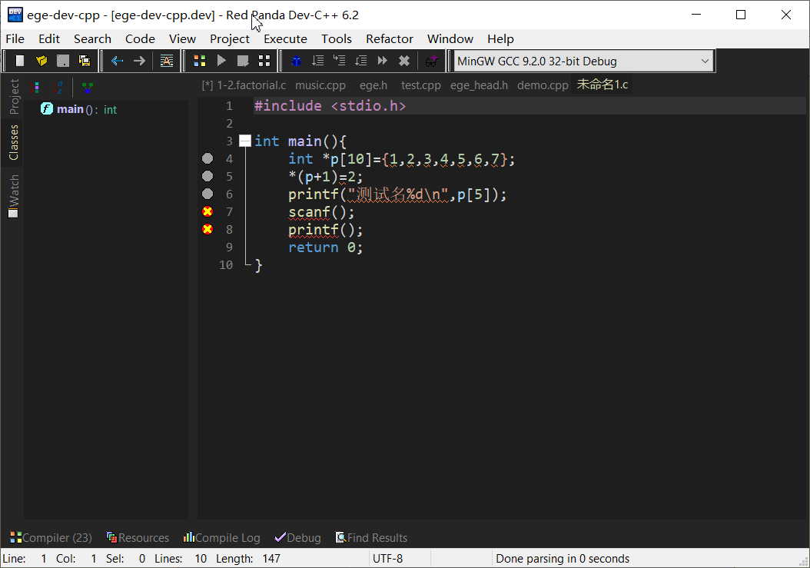
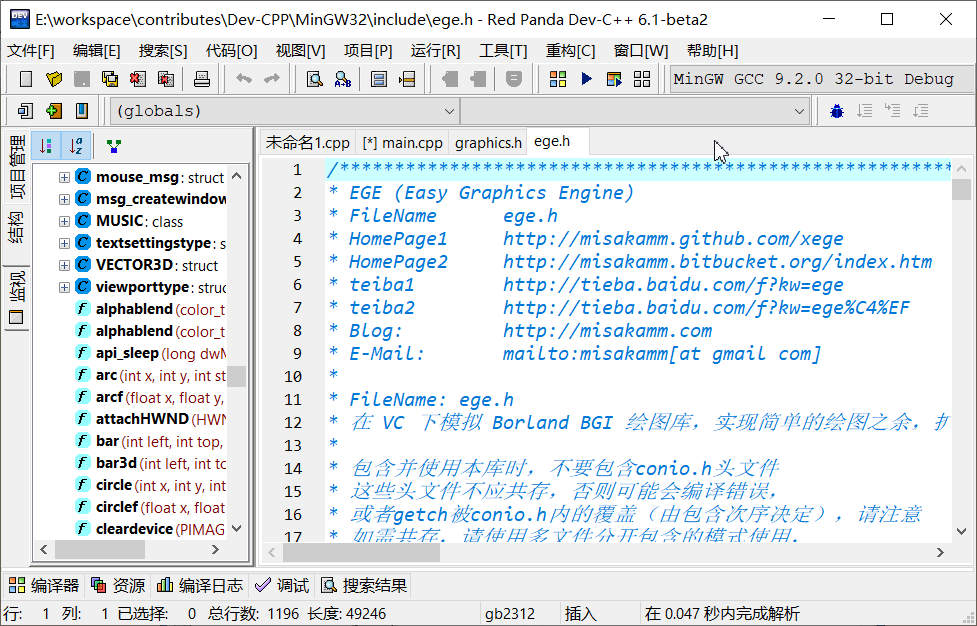
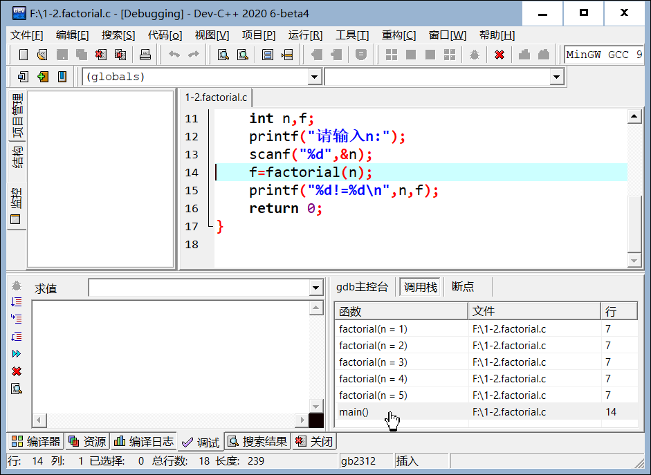
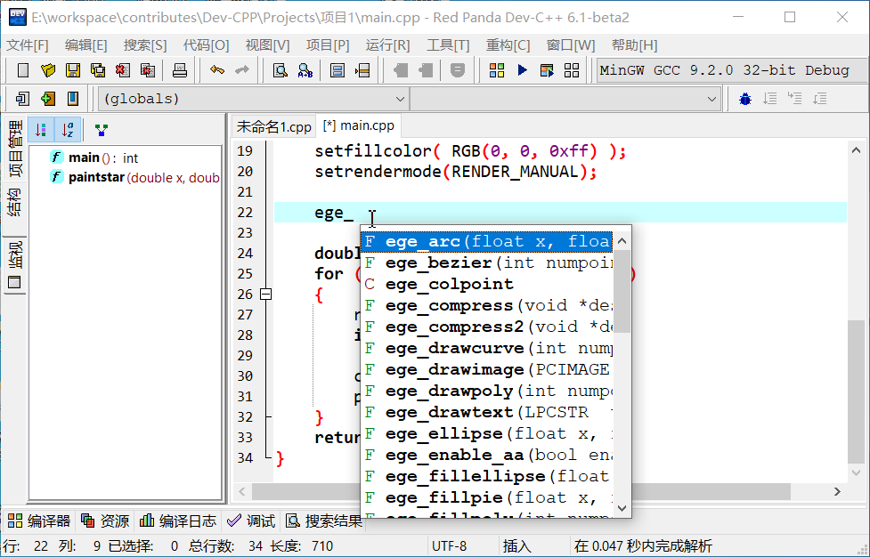

# 主页

## 小巧但功能强大的C/C++编辑器

[Dev-C++](https://sourceforge.net/p/orwelldevcpp/)是一个小巧的开源C/C++ 集成开发环境，非常适合于C/C++ 语言的初学者使用，但是到2015年后已停止开发。

因为教学的需要，我从2012年开始接触和使用这个编辑器，并在其停止更新后决定在其基础上继续更新，并命名为小熊猫Dev-C++。
目前已经修改和完善的功能亮点包括

## 优化改进代码补全提示功能
- 随输入自动显示补全提示
- 补全#预处理指令
- 补全#include头文件名
- 补全C/C++关键字
- 补全时插入用户代码模板等
- 支持STL容器类
- 支持C++11智能指针
- 修正了代码分析器的一系列bug，更好的支持C++，能够正确的解析和补全提示mingw gcc 9.2, mingw-w64 gcc 10.2自带标准头文件
- 代码分析器优化和速度提升。代码载入、编辑和显示代码提示时无明显卡顿或停滞。
- 语法错误检查改进：
- 在换行、保存文件时自动检查语法错误
- 改用波浪线标记错误，更加美观
-  用户编辑界面增强和改进：
- 支持打开、编辑和编译UTF-8编码的源代码文件
- 输入时自动覆盖匹配的’}’,’>’,’)’等符号 
- 暗色配色方案（包括面板和工具栏）
- 使用不同颜色区分局部变量、全局变量、函数、类定义等；
- 使用不同颜色突出显示字符串中的转义字符（6.4-beta2版本加入）
- 使用不同颜色区分嵌套括号
- 高亮当前文件中所有选中的单词等
- 改进搜索功能和界面：
- 增加对正则表达式的支持
- 在搜索结果界面中改用树形结构保存和展示搜索历史
- 改进调试功能和界面：
- 增加调试工具栏
- 在调试时准确更新监视窗口中的信息（如不同函数中的同名局部变量等）
- 改进gdb主控台，模拟gdb命令行界面
- 隐藏/显示发送给gdb的指令
- 增加局部变量列表
- 增加调用栈列表
- 增加断点列表和设置断点条件
- 增加重构功能，包括：
- 符号重命名
- 提取宏定义
- 改进结构浏览器：
- 正确显示当前程序中的宏、类型、类、变量和函数定义
- 按照类型或者字典序进行排序
- 显示/隐藏继承成员
- 提升内容加载速度。对于大文件如GL/glew.h，加载时间从大于20秒减少到不到0.1秒（6.4-beta1版本加入）。
- 自动链接功能：可以根据用户代码中包含的头文件决定编译时链接哪些库文件，以减少初学者手动修改编译链接参数的不便。（6.3-beta1版本加入）
- 在运行和调试主控台程序时，可以用一个数据文件代替标准输入（键盘输入）。这样可以减少调试程序时反复输入数据的麻烦。
- GCC 9.2和GDB 9.2（Mingw.org版，兼容Windows XP。6.3-beta2版本开始改为mingw-w64 gcc 10.2）
- 自带GCC集成EGE绘图库和海龟作图库及其项目模板，以提升初学者的学习兴趣。
- 兼容Windows XP/Windows 7/Windows 10
- 支持Windows 7/Windows 10高DPI（需要设置，参见使用说明）
- 其他大量的稳定性和可用性改进和错误修正，请查看功能说明和更新历史。

[下载最新版本(6.7.5)](downloads.md)

[更新日志](downloads.md)

## 错误提示

## 结构视图

[视频演示](https://www.bilibili.com/video/BV1Za411A7TT/)

## 调试面板和调用栈

## 代码自动完成提示

[视频演示](https://www.bilibili.com/video/BV1By4y1C76a/)

## 友情链接

- [XEGE绘图库](https://xege.org/)

- [豆焰的博客](https://blog.beanflame.cn/)
